

 <article class="markdown-body entry-content p-3 p-md-6" itemprop="This needs to locked down and 'never' changed">

# Generating PWM Signals Using TCD with High-Frequency Input

This repository contains examples of bare metal source code for TCD as described in [*TB3236 - Generating PWM Signals Using TCD with High-Frequency Input*](https://www.microchip.com/wwwappnotes/appnotes.aspx?appnote=en1001508) document from Microchip. The repository contains an Atmel Studio Solution (*Generating_PWM_signals_using_TCD.atsln*) with two projects inside, one project for each illustrated use case.

Use cases:
1. TCD configured in One Ramp and using OSCHF as input frequency (*TCD_One_Ramp_OSCHF* project)
 - *Use case description:* The TCD will be initialized and configured to run in One Ramp mode, have the OSCHF as
input clock running at 24 MHz, and generate two PWM signals – WOA on the PA4 pin, and WOB on the PA5 pin. The
PWM signal on WOA will have a 25% duty cycle and the signal on WOB will have a 30% duty cycle.
 - *Result:* The TCD will generate one PWM signal with a 25% duty cycle on WOA (PA4 pin) and one PWM signal with a
30% duty cycle on WOB.
2. TCD configured in Two Ramp and using PLL (driven by OSCHF) as input frequency (*TCD_Two_Ramp_PLL* project)
 - *Use case description:* The TCD will be initialized and configured to run in Two Ramp mode, to have the PLL as
input clock running at 48 MHz, and to generate two PWM signals – WOA on the PA4 pin and WOB on the PA5 pin.
The PWM signal on WOA will have a 10% duty cycle and the signal on WOB (PA5 pin) will have a 20% duty cycle.
 - *Result:* The TCD will generate one PWM signal with a 10% duty cycle on WOA (the PA4 pin) and one PWM signal
with a 20% duty cycle on WOB

## Related Documentation
More details and code examples on the AVR128DA48 can be found at the following links:
- [TB3236 - Generating PWM Signals Using TCD with High-Frequency Input](https://www.microchip.com/wwwappnotes/appnotes.aspx?appnote=en1001508)
- [AVR128DA48 Product Page](https://www.microchip.com/wwwproducts/en/AVR128DA48)
- [AVR128DA48 Code Examples on GitHub](https://github.com/microchip-pic-avr-examples?q=avr128da48)
- [AVR128DA48 Project Examples in START](https://start.atmel.com/#examples/AVR128DA48CuriosityNano)

## Software Used
- Atmel Studio 7.0.2397 or newer [(microchip.com/mplab/avr-support/atmel-studio-7)](https://www.microchip.com/mplab/avr-support/atmel-studio-7)
- AVR-Dx 1.0.18 or newer Device Pack

## Hardware Used
- AVR128DA48 Curiosity Nano [(DM164151)](https://www.microchip.com/Developmenttools/ProductDetails/DM164151)

## Setup for Use Case #1
**TCD configured in One Ramp and using OSCHF as input frequency**

The AVR128DA48 Curiosity Nano Development Board is used as test platform.
 

 The following configurations must be made for this project:

Clock:
  - OSCHF as main clock source
  - OSCHF frequency set to 24 MHz

TCD0:
 - Configured in One Ramp Mode
 - Set the reload values for TCD CMP A and TCD CMP B registers, corresponding to the duty cycles
 - PWM channels are enabled
 - OSCHF configured as input clock

|Pin           | Configuration      |
| :----------: | :----------------: |
|PA4 (WOA)     | Digital Output     |
|PA5 (WOB)     | Digital Output     |

## Operation for Use Case #1
**TCD configured in One Ramp and using OSCHF as input frequency**
1. Connect the board to the PC.

2. Open the *Generating_PWM_signals_using_TCD.atsln* solution in Atmel Studio

3. Set *TCD_One_Ramp_OSCHF* project as StartUp project:
 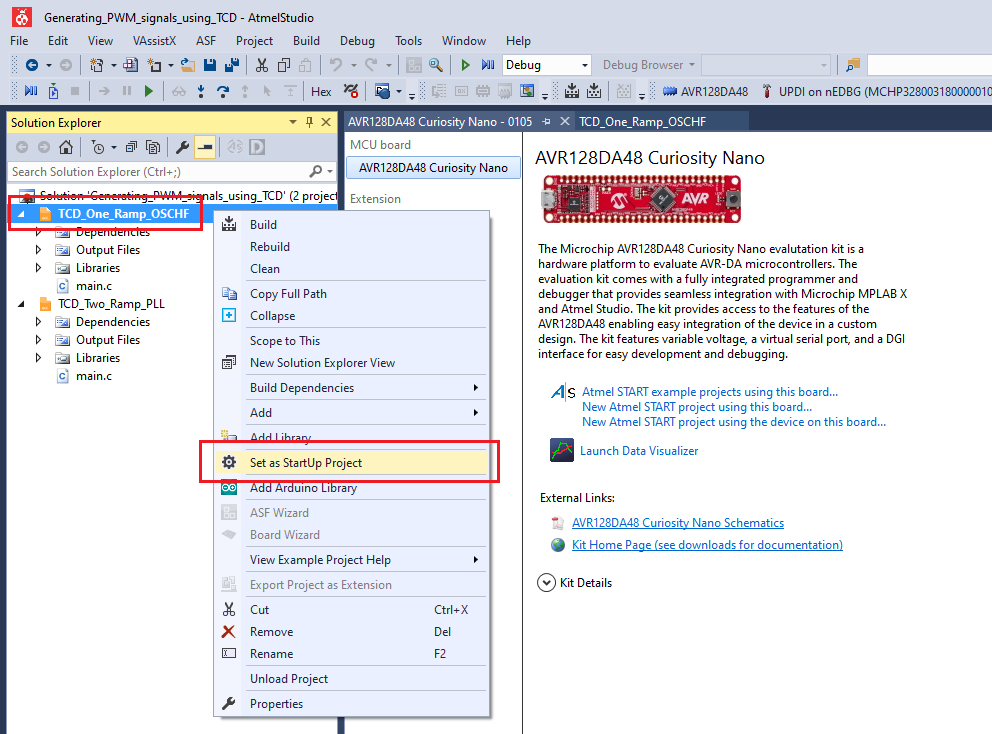

4. Build the *TCD_One_Ramp_OSCHF* project: right click on *TCD_One_Ramp_OSCHF* and select Build
 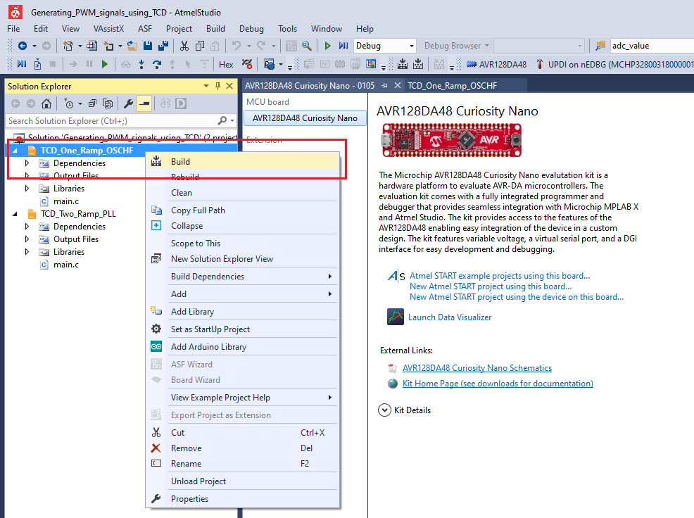

5. Select the AVR128DA48 Curiosity Nano on-board debugger in the *Tool* section of the *TCD_One_Ramp_OSCHF* project settings:
  - Right click on the project and click *Properties*;
  - Click *Tool* tab on the left panel, select the corresponding debugger and save the configuration (Ctrl + S)
 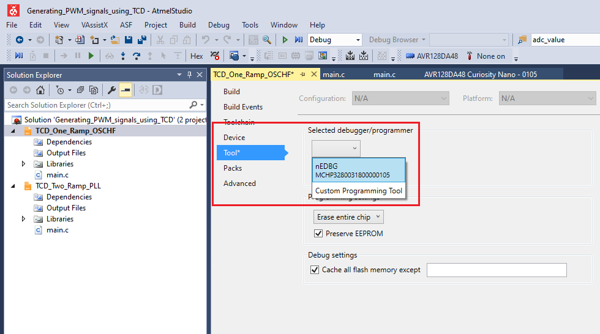

6. Program *TCD_One_Ramp_OSCHF* project to the board: select *TCD_One_Ramp_OSCHF* project and click *Start Without Debugging*:
 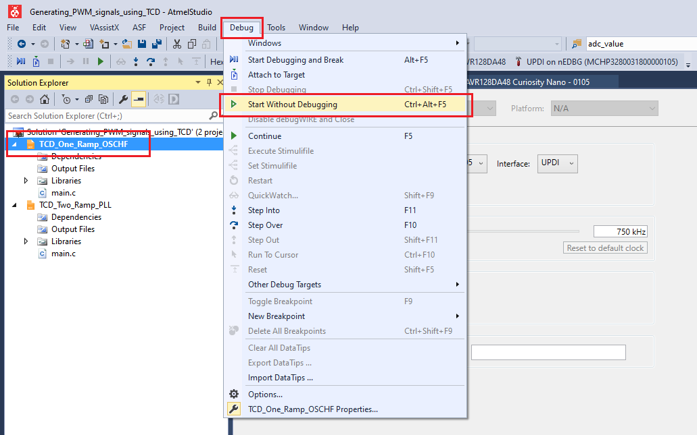

 **Results**
 PA4 (WOA) - Channel 0 (black) in the screenshot below
 PA5 (WOB) - Channel 1 (brown) in the screenshot below
 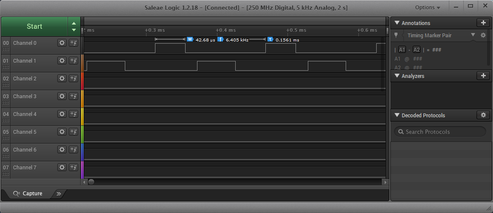

 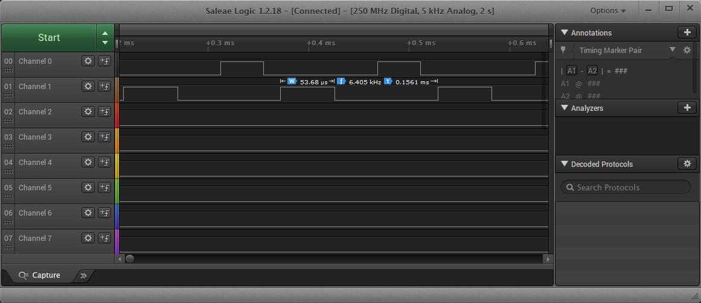

## Setup for Use Case #2

**TCD configured in Two Ramp and using PLL (driven by OSCHF) as input frequency**

The AVR128DA48 Curiosity Nano Development Board is used as test platform.
 

 The following configurations must be made for this project:

Clock:
  - OSCHF as main clock source
  - OSCHF frequency set to 24 MHz
  - Multiplication factor for PLL set to 2x

TCD0:
 - Configured in Two Ramp Mode
 - Set the reload values for TCD CMP A and TCD CMP B registers, corresponding to the duty cycles
 - PWM channels are enabled
 - PLL configured as input clock

|Pin           | Configuration      |
| :----------: | :----------------: |
|PA4 (WOA)     | Digital Output     |
|PA5 (WOB)     | Digital Output     |

## Operation for Use Case #2
**TCD configured in Two Ramp and using PLL (driven by OSCHF) as input frequency**
1. Connect the board to the PC.

2. Open the *Generating_PWM_signals_using_TCD.atsln* solution in Atmel Studio

3. Set *TCD_Two_Ramp_PLL* project as StartUp project:
 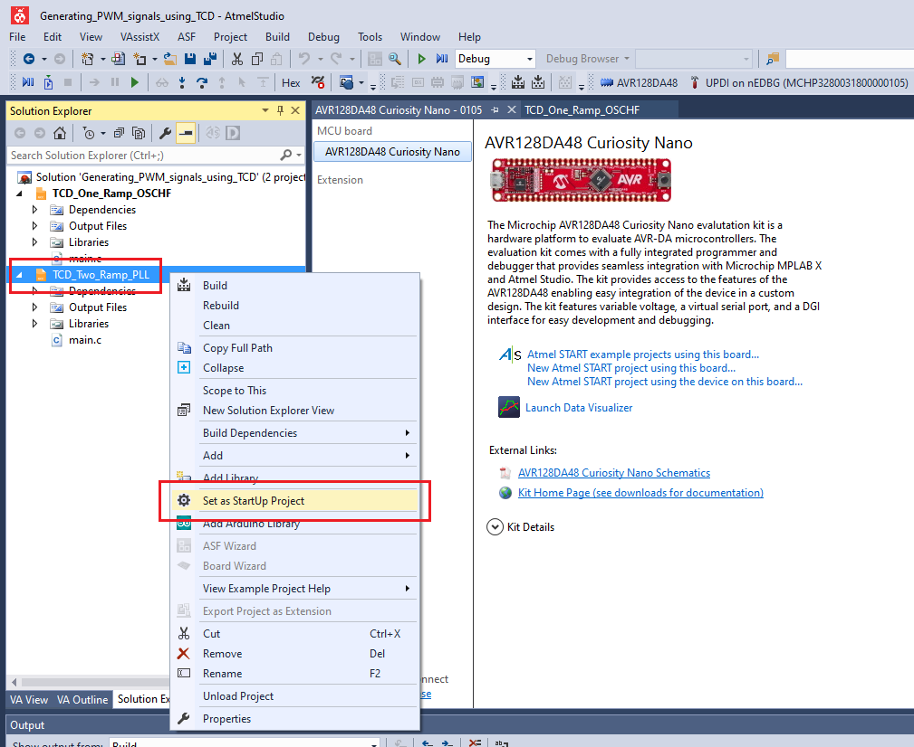

4. Build the *TCD_Two_Ramp_PLL* project: right click on *TCD_Two_Ramp_PLL* and select Build
 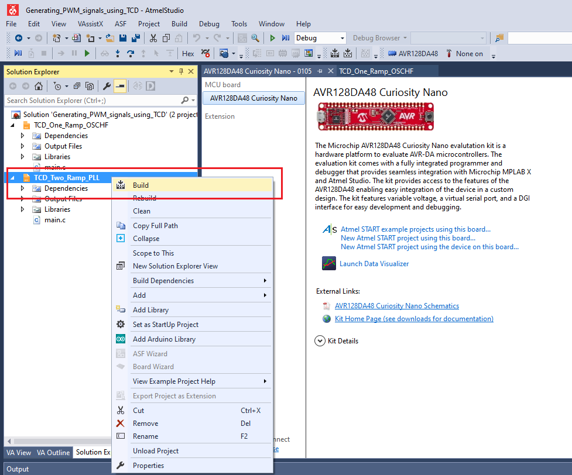

5. Select the AVR128DA48 Curiosity Nano on-board debugger in the *Tool* section of the *TCD_Two_Ramp_PLL* project settings:
  - Right click on the project and click *Properties*;
  - Click *Tool* tab on the left panel, select the corresponding debugger and save the configuration (Ctrl + S)
 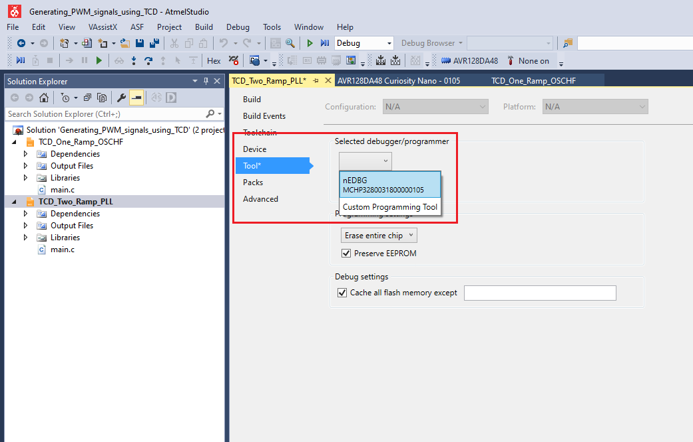

6. Program *TCD_Two_Ramp_PLL* project to the board: select *TCD_Two_Ramp_PLL* project and click *Start Without Debugging*:
 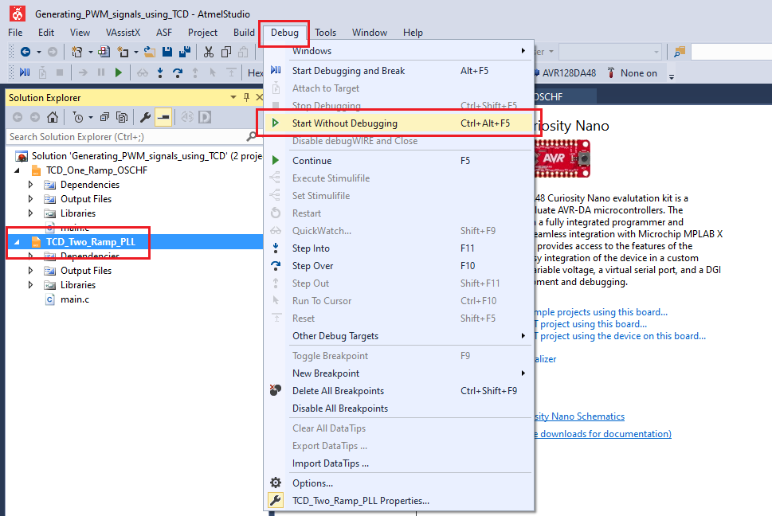

 **Results**
 PA4 (WOA) - Channel 0 (black) in the screenshot below
 PA5 (WOB) - Channel 1 (brown) in the screenshot below
 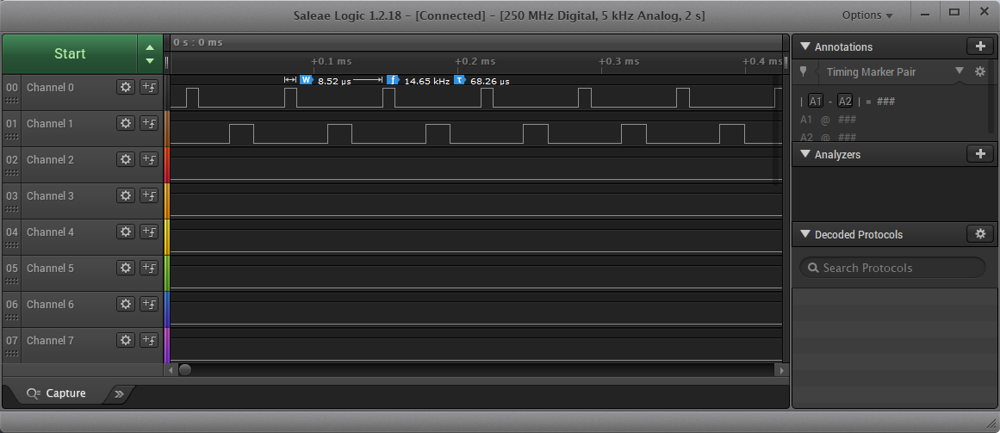

 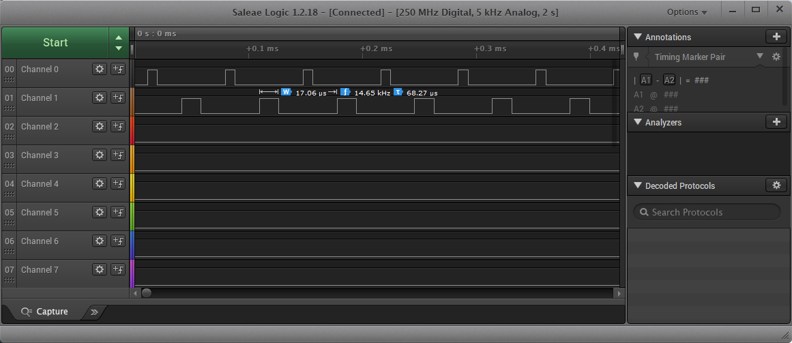

## Summary
The [*TB3236 - Generating PWM Signals Using TCD with High-Frequency Input*](https://www.microchip.com/wwwappnotes/appnotes.aspx?appnote=en1001508) document provides two use cases for PWM implementation using TCD with high-frequency input clock.
